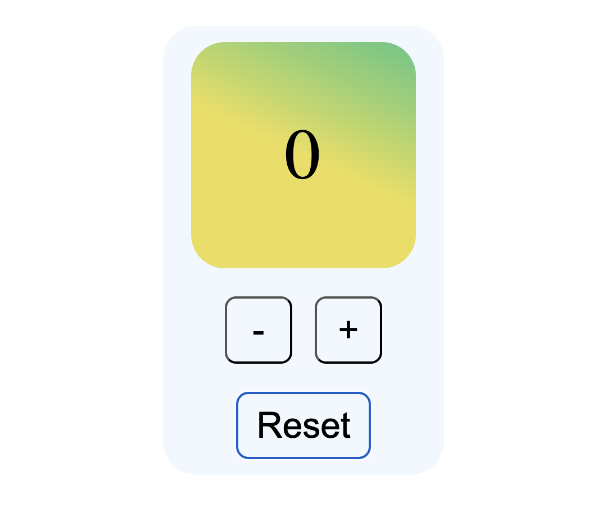

# Simple Counter

A micro learning project built with HTML, CSS, and JavaScript.

The goal of this project is to practice basic DOM manipulation and event handling by implementing a simple counter.
The counter value cannot go below zero.

## Features:

	•	Increment and decrement counter value
  
	•	Minimal UI
  
	•	No frameworks or build tools

## Preview: 

